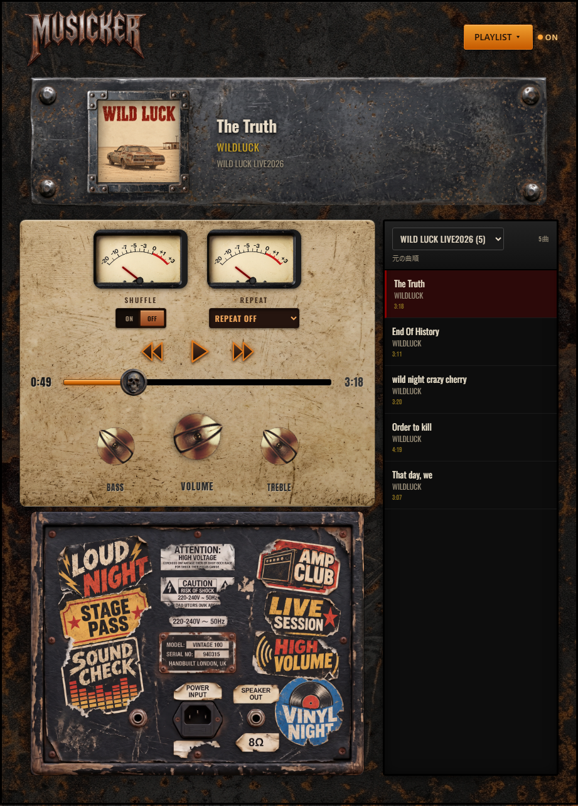

# Musicker

手持ちの音楽を、ヴィンテージアンプ風の画面で楽しめる無料の Windows アプリです。

画像は架空のバンド WILDLUCK のサンプル曲とジャケットを表示したものです。サンプル曲とジャケットは配布アプリに含まれていません。

## ダウンロード

[最新版の Musicker をダウンロード](../../releases/latest)

「Releases」にある Windows 64 ビット用の `.exe` を保存して起動してください。インストールは不要です。

この版はデジタル署名がありません。Windows の保護機能が警告や実行制限を表示する場合があります。ダウンロード元を確認してから使用してください。

## 使い方

1. 右上の **PLAYLIST** を開きます。
2. 「iTunesプレイリストを読み込む」または「音楽フォルダを読み込む」を選びます。
3. 曲を選んで再生します。**SHUFFLE** と **REPEAT** で再生方法を変えられます。

音楽ファイルは同梱されていません。ご自身の音楽ファイルを指定して使ってください。iTunesプレイリストを使う場合は、ライブラリの XML ファイルが必要です。

## 対応環境

Windows 64 ビット
